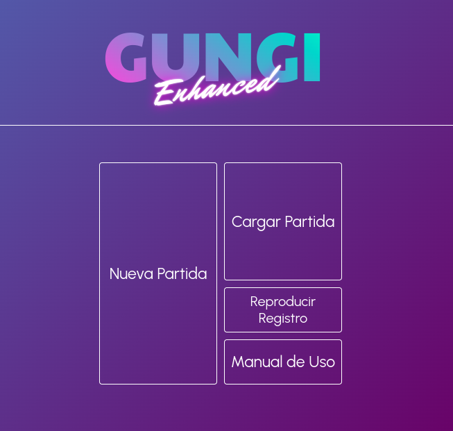
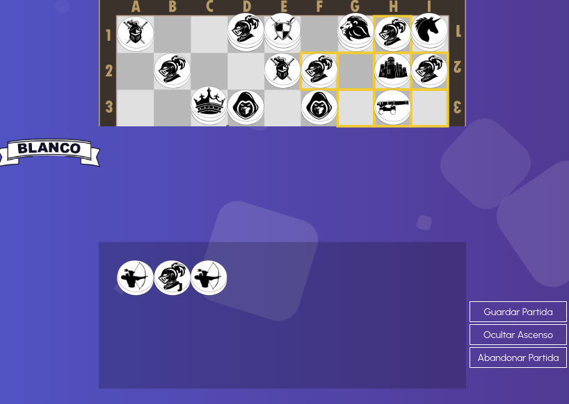
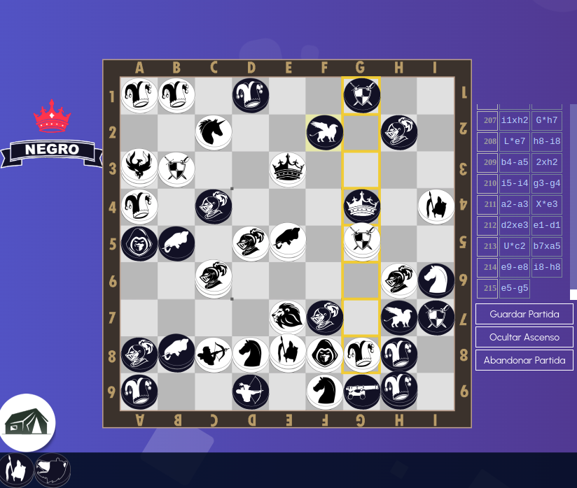

# Gungi Enhanced
Gungi Enhanced es juego de tablero implementado en Javascript y HTML. Está basado en el juego de mesa ficticio "Gungi" de la serie Hunter x Hunter de Yoshihiro Togashi. Aunque no existan reglas oficiales del mismo, la comunidad ha intentado en múltiples ocasiones detallarlas. En Gungi Enhanced, se introduce un nuevo Libro de Reglas que incluye mejoras respecto a las reglas de otros conjuntos similares y añade características adicionales que enriquecen las estrategias. El juego incluye una interfaz para agregar IAs custom.

#Screenshots

